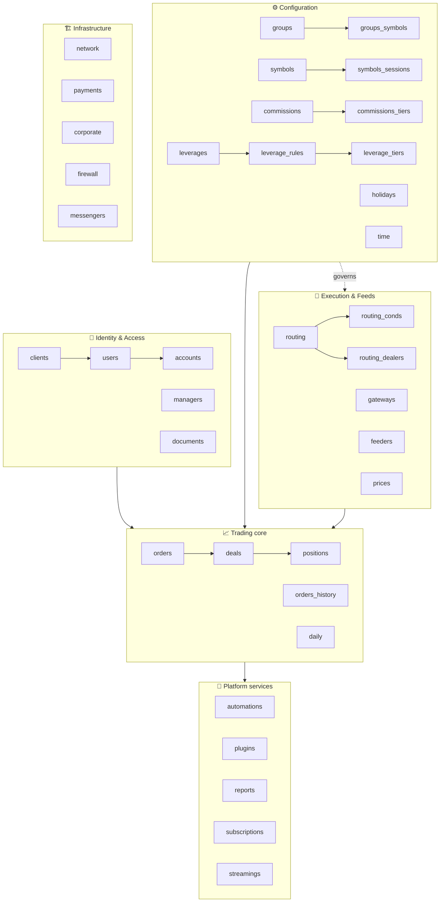
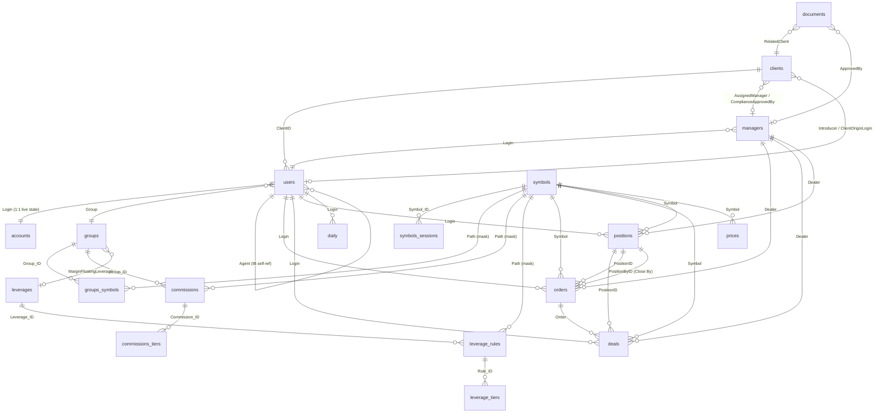
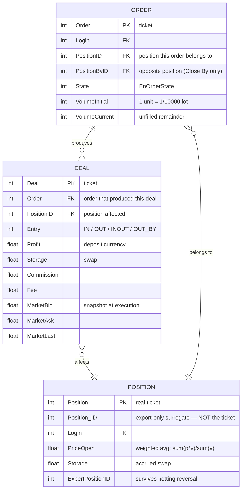
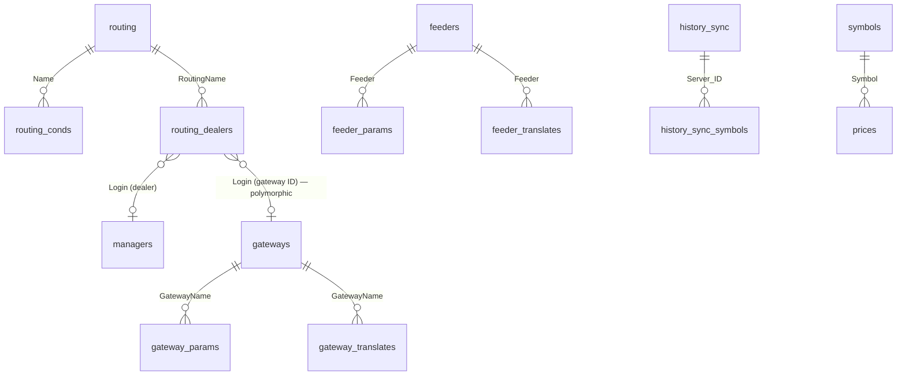
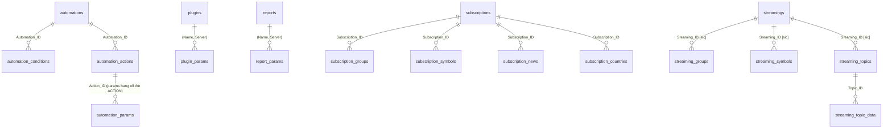

# HST v2 — Full Data Model & ER Diagram (MT5 parity)

Complete entity-relationship model derived field-by-field from the **MetaTrader 5 SQL Export schema**
(`MetaTrader5/Meta Document - SQL/`, 84 `sql_mt5_*` tables). This is the authoritative data-model
reference for building HST v2 from scratch.

| Layer | File | Contents |
|---|---|---|
| **This file** | `er_diagram.md` | ER diagrams (master + per domain), table index, relationship graph, design rules |
| Field catalogs | [`tables/01-trading-core.md`](tables/01-trading-core.md) | orders, deals, positions, orders_history, prices, daily(+orders/positions) |
| | [`tables/02-accounts-people.md`](tables/02-accounts-people.md) | accounts, users, clients, documents, managers, email, allocations(+agreements) |
| | [`tables/03-instruments-groups.md`](tables/03-instruments-groups.md) | symbols(+sessions), groups(+symbols), commissions(+tiers), leverages(+rules/tiers), holidays, time(+weekdays), spreads(+legs) |
| | [`tables/04-execution-feeds.md`](tables/04-execution-feeds.md) | routing(+conds/dealers), gateways, feeders (+params/translates), history_sync(+symbols) |
| | [`tables/05-automation-reports-streaming.md`](tables/05-automation-reports-streaming.md) | automations, plugins, reports, subscriptions, streamings (Kafka) |
| | [`tables/06-payments-network-infra.md`](tables/06-payments-network-infra.md) | payments, pay_wallets, corporate, network topology, antiddos, firewall, messengers |
| **Enums** | [`tables/07-enums.md`](tables/07-enums.md) | every enumeration with numeric values |

**Naming convention in this document:** MT5 table names are quoted as-is (`mt5_orders`). HST v2 tables
drop the prefix (`orders`). Field names are kept identical to MT5 wherever the semantics match — this
is deliberate, so the MT5 documentation remains a usable reference during implementation.

---

## 1. Domain map

**Build priority for v1:** Identity + Configuration + Trading core + Execution (domains 01-04).
Platform services and Infrastructure (05-06) are broker back-office and can follow.

---

## 2. Core ER diagram — Identity, Configuration, Trading

The heart of the system. Everything a BUY/SELL cycle touches.

### The trade triad — the single most important relationship

**Rules encoded here:**
- An **order** is intent, a **deal** is the execution fact (and *every* money movement — deposits,
  swaps, commissions are all deals), a **position** is the net result.
- Volumes are **fixed-point integers**: 1 unit = 1/10000 lot; `*Ext` columns = 1/100000000 lot.
  Never floats.
- `Position` is the trade ticket; `Position_ID` is an export-side surrogate key. Do not confuse them.
- On netting reversal the position ticket changes but `ExpertPositionID` persists.

---

## 3. Execution & Data Feed ER diagram

**Key insight:** `routing_dealers.Login` is a **single numeric column holding either a dealer login or
a gateway ID**. This is the schema proof that in MT5 *the routing rule owns the execution destination* —
auto-execution, a specific dealer desk, or an external venue are all expressed the same way. HST today
cannot do this (rules can only decorate/veto an order); v2 must adopt it.

**Typed-value pattern** (used by both routing rules and their conditions):

| Column | Purpose |
|---|---|
| `ActionType` / `Type` | discriminator: `0`=no value, `1`=String, `2`=Int, `3`=UInt, `4`=Float |
| `ActionValueInt` / `ValueInt` | value when discriminator = 2 |
| `ActionValueUInt` / `ValueUInt` | value when discriminator = 3 |
| `ActionValueFloat` / `ValueFloat` | value when discriminator = 4 |
| `ActionValueString` / `ValueString` | value when discriminator = 1 (symbol masks land here) |

Adopt this instead of a stringly-typed `value TEXT` column — it keeps type safety in the database.

---

## 4. Platform services ER diagram

Notes: `automation_params` hangs off the **action**, not the automation. `plugins`/`reports` have no
surrogate key — identity is the composite `(Name, Server)`. `Sreaming_ID` is misspelled that way in the
official MT5 docs; v2 should spell it correctly. Streaming = **Kafka** (`streamings.Address` is a broker
list, published topic = `Prefix` + `Topic`).

---

## 5. Infrastructure ER diagram

```mermaid
erDiagram
    network ||--o{ network_trade_servers : "Login"
    network ||--o{ network_history_servers : "Login"
    network ||--o{ network_backup_servers : "Login"
    network ||--o{ network_backup_folders : "Login"
    network ||--o{ network_access_servers : "Login"
    network ||--o{ network_antiddos : "Login"
    network_antiddos ||--o{ antiddos_servers : "Login"
    network_antiddos ||--o{ antiddos_sources : "Login"
    pay_wallets ||--o{ pay_wallet_params : "PaymentWallet_ID"
    pay_wallets ||--o{ pay_wallet_groups : "PaymentWallet_ID"
    pay_wallets ||--o{ pay_wallet_countries : "PaymentWallet_ID"
    pay_wallets ||--o{ pay_wallet_commissions : "PaymentWallet_ID"
    pay_rules ||--o{ pay_rule_conditions : "PaymentRule_ID"
    corporate ||--o{ corporate_links : "Corporate_ID"
    messengers ||--o{ messenger_groups : "Messenger_ID"
    messengers ||--o{ messenger_countries : "Messenger_ID"
    payments }o--|| users : "Login / Manager"
    payments }o--o| deals : "DealID"
    allocations ||--o{ allocations_agreements : "Allocation_ID"
```

`firewall` is standalone (ordered by `Rule_Index`, no FK). `payment_history` mirrors `payments`
field-for-field (107 columns each).

---

## 6. Complete table index (84 tables)

### Trading core — [detail](tables/01-trading-core.md)
| Table | Purpose | PK |
|---|---|---|
| `mt5_orders` | live/open orders | `Order` (ticket) |
| `mt5_orders_history` | historical orders (separate table, not a status flag) | `Order` |
| `mt5_deals` | execution facts + all money operations; optional per-year partitioning (`mt5_deals_2026`) | `Deal` |
| `mt5_positions` | net open positions | `Position_ID` (export) / `Position` (ticket) |
| `mt5_prices` | tick/price records | — |
| `mt5_daily` | EOD snapshot per login (balances, prev-day/month equity, commissions, interest) | `(Datetime, Login)` |
| `mt5_daily_orders` | EOD order snapshot | |
| `mt5_daily_positions` | EOD position snapshot | |

### Identity & access — [detail](tables/02-accounts-people.md)
| Table | Purpose | PK |
|---|---|---|
| `mt5_clients` | KYC person; one client owns many logins | `ClientID` |
| `mt5_users` | login / trading account record (rights, leverage, group) | `Login` |
| `mt5_accounts` | live financial state, 1:1 with users | `Login` |
| `mt5_managers` | back-office logins; ~100 `Right_*` boolean columns | `Login` |
| `mt5_documents` | KYC documents with status/versioning | |
| `mt5_email` | mail-server configs | `Name` |
| `mt5_allocations`, `mt5_allocations_agreements` | block-trade allocation | `Allocation_ID` |

### Configuration — [detail](tables/03-instruments-groups.md)
| Table | Purpose | PK |
|---|---|---|
| `mt5_symbols` | instrument master (100+ fields: calc mode, margin, swaps, execution) | `Symbol_ID` |
| `mt5_symbols_sessions` | quote/trade session intervals | |
| `mt5_groups` | client group = central config unit | `Group_ID` |
| `mt5_groups_symbols` | per-group symbol overrides by **path mask**; `NULL` = inherit | |
| `mt5_commissions`, `mt5_commissions_tiers` | commission configs + tier ladders | `Commission_ID` / `Tier_ID` |
| `mt5_leverages`, `mt5_leverage_rules`, `mt5_leverage_tiers` | floating-leverage profiles; tiers carry margin **rates** | `Leverage_ID` / `Rule_ID` / `Tier_ID` |
| `mt5_holidays` | trading holidays by symbol mask | |
| `mt5_time`, `mt5_time_weekdays` | timezone / DST config | `TimeZone` |
| `mt5_spreads`, `mt5_spread_legs` | synthetic/spread instruments | `ID` |

### Execution & feeds — [detail](tables/04-execution-feeds.md)
`mt5_routing`, `mt5_routing_conds`, `mt5_routing_dealers`, `mt5_gateways`(+`_params`,`_translates`),
`mt5_feeders`(+`_params`,`_translates`), `mt5_history_sync`(+`_symbols`).

### Platform services — [detail](tables/05-automation-reports-streaming.md)
`mt5_automations`(+`_conditions`,`_actions`,`_params`), `mt5_plugins`(+`_params`),
`mt5_reports`(+`_params`), `mt5_subscriptions`(+`_groups`,`_symbols`,`_news`,`_countries`),
`mt5_streamings`(+`_groups`,`_symbols`,`_topics`,`_topic_data`).

### Infrastructure — [detail](tables/06-payments-network-infra.md)
`mt5_payments`, `mt5_payment_history`, `mt5_pay_wallets`(+4 children), `mt5_pay_rules`(+conditions),
`mt5_corporate`(+links), `mt5_network`(+6 server tables), `mt5_network_antiddos`,
`mt5_antiddos_servers`, `mt5_antiddos_sources`, `mt5_firewall`, `mt5_messengers`(+2).

---

## 7. Design rules to carry into HST v2

Derived from the schema, and from comparing it against the current HST implementation
(see `../../docs/ADMIN_MANAGER_PANEL_DEEP_DOCS.md` §11 for the current system's defects).

1. **Fixed-point integer volumes.** `Volume` = 1/10000 lot, `VolumeExt` = 1/10⁸ lot. Float lots
   accumulate rounding drift across millions of aggregations.
2. **Deals are the universal ledger.** Deposits, withdrawals, swaps, commissions, corrections — all are
   deals with a `Action`/`Entry` classification. One append-only money table, no side channels.
3. **Freeze a snapshot on every trade row.** `ContractSize`, `Digits`, `DigitsCurrency`, `TickValue`,
   `TickSize`, `RateProfit`, `RateMargin` are copied onto orders/deals/positions so history stays
   replayable after config edits.
4. **Three market-price columns on deals** (`MarketBid`, `MarketAsk`, `MarketLast`) — never one.
5. **`NULL` means inherit** in `groups_symbols`. One nullable column per overridable field beats
   duplicating the full symbol row plus a parallel table of ~60 `Inherited` booleans.
6. **Typed-value columns with a discriminator** for rule/condition/action values.
7. **Routing owns the destination** — `routing_dealers` holds dealer logins *and* gateway IDs.
8. **Leverage tiers are margin-rate multipliers** (`MarginRateInitial`/`MarginRateMaintenance`),
   applied as marginal brackets, not a leverage number swapped per slice.
9. **Account state is decomposed**: `Margin`, `MarginInitial`, `MarginMaintenance`, `Storage`,
   `Floating`, `Equity`, `BlockedProfit`, `BlockedCommission`, `Assets`, `Liabilities` are separate
   columns. In particular:
   > **`Floating = Profit + Storage + Commission` of open positions, and
   > `Equity = Balance + Credit + Floating`.**
   > The current HST engine computes `equity = balance + credit + Σ position.Profit`, omitting swap and
   > commission — which makes margin level too high and stop-out fire **late**. v2 must implement the
   > MT5 formula. See `../../docs/mt5/08-order-lifecycle-flowchart.md`.
10. **A per-row `Timestamp` change marker** on every table — free CDC/replication hook.
11. **Millisecond twin columns** (`Time` + `TimeMsc`) rather than one column of ambiguous precision.
12. **`ExternalID` + `ApiData` on every trade record** — extensibility without migrations.
13. **Separate live and history tables** (`orders` vs `orders_history`), plus optional per-year
    partitioning for deals — the archive tier is a schema decision, not an afterthought.
14. **Composite natural keys where they're natural** (`plugins(Name, Server)`), surrogate keys elsewhere.

## 7b. Enum catalog — [`tables/07-enums.md`](tables/07-enums.md)

**68 enumerations + 5 return-code bands**, every value verified against the MetaQuotes sources
(never inferred). Coverage by domain:

| Domain | Enums |
|---|---|
| Orders / Deals / Positions | `EnOrderType`, `EnOrderState`, `EnOrderFilling`, `EnOrderTime`, `EnOrderReason`, `EnOrderActivation`, `EnTradeActivationFlags`, `EnTradeModifyFlags`, `EnDealAction`, `EnDealEntry`, `EnDealReason`, `EnPositionAction`, `EnPositionReason`, `EnActivation` |
| Trade requests | `EnTradeActions`, `EnTradeActionFlags`; retcodes **0-1** success, **10001-10046** trade requests, **11000-11002** dealer, **4001-4009** trade management, **15000-15007** subscriptions |
| Symbols | `EnCalcMode`, `EnTradeMode`, `EnExecutionMode`, `EnFillingFlags`, `EnExpirationFlags`, `EnOrderFlags`, `EnGTCMode`, `EnSwapMode`, `EnSwapDays`, `EnSwapFlags`, `EnMarginFlags`ᴬ, `EnMarginRateTypes`, `EnTickFlags`, `EnChartMode`, `EnOptionMode`, `EnSpliceType`, `EnSpliceTimeType`, `EnInstantMode`, `EnRequestFlags`, `EnTradeFlags`ᴮ, `EnSectors`, `EnIndustries` |
| Groups | `EnMarginMode`, `EnStopOutMode`, `EnFreeMarginMode`, `EnMarginFreeProfitFlags`, `EnMarginFlags`ᴬ, `EnTradeFlags`ᴮ, `EnPermissionsFlags`, `EnAuthMode`, `EnAuthOTPMode`, `EnHistoryLimit`, `EnTransferMode`, `EnReportsMode`, `EnReportsFlags`, `EnNewsMode`, `EnMailMode` |
| Users / Clients / Managers | `EnUsersRights`, `EnUsersPasswords`, `EnUsersConnectionTypes`, `EnSoActivation`, `EnManagerRights` (~90 members), `EnManagerRightFlags`, `EnManagerLimit`, `EnClientType`, `EnClientStatus`, `EnGender`, `EnClientOrigin`, `EnKYCStatus`, `EnEmployment`, `EnEmploymentIndustry`, `EnEducationLevel`, `EnWealthSource`, `EnPreferredCommunication`, `EnTradingExperience`, `EnDocumentTypes`, `EnDocumentSubtype`, `EnDocumentStatus` |
| Commissions | `EnCommMode`, `EnCommRangeMode`, `EnCommChargeMode`, `EnCommEntryMode`, `EnCommActionMode`, `EnCommProfitMode`, `EnCommReasonFlags`, `EnCommTierMode`, `EnCommTierType` |
| Routing / Leverage | `EnRouteFlags`, `EnTypeFlags`, `EnRouteAction`, `EnRouteCondition`, `EnConditionRule`, `EnRangeMode` |

### ⚠️ Name collisions — do NOT share types when generating code

| Name | Two distinct enums | Consequence if merged |
|---|---|---|
| **`EnMarginFlags`**ᴬ | symbol-level (`CHECK_PROCESS 0x1`, `CHECK_SLTP 0x2`, `HEDGE_LARGE_LEG 0x4`, `EXCLUDE_PL 0x8`, `RECALC_RATES 0x10`) **vs** group-level (`CLEAR_ACC 1`) | silently wrong margin behaviour |
| **`EnTradeFlags`**ᴮ | symbol-level (`PROFIT_BY_MARKET 1`, `ALLOW_SIGNALS 2`) **vs** group-level (`SWAPS 0x001` … `SO_COMPENSATION_CREDIT 0x800`) | silently wrong permission checks |
| **`EnOrderActivation` (0-4)** vs **`EnActivation` (0-3)** | orders **vs** positions | wrong activation semantics |

Generate these as `SymbolMarginFlags` / `GroupMarginFlags`, `SymbolTradeFlags` / `GroupTradeFlags`,
`OrderActivation` / `PositionActivation`.

### Documented gaps (flagged, not guessed)

- `EnUsersLoginFlags` and `EnClientRights` **do not exist** in either corpus — per-account permissions
  live entirely on `EnUsersRights`.
- Three partial unknowns are marked in the catalog rather than invented: `EnUsersRights` bit `0x1000`
  (undocumented, treat as reserved — **not** free), `CLIENT_ORIGIN_REAL` (numeric value blank in the
  source; positionally 4 but unconfirmed), and `EnCommReasonFlags` `0x80`/`0x100` (values documented on
  the SQL page but with no symbolic names).

---

## 8. Known source quirks (preserved deliberately in the field catalogs)

| Quirk | Where | v2 action |
|---|---|---|
| `Sreaming_ID` misspelling | streaming child tables | fix spelling |
| `PairrServer`, `PerfSocketsCritial`, `ProviderCurrecnyRate`, `ExernalErrorCode` | network / payments | fix spelling |
| `SysConnection` polarity inverted: 0=connected (gateways) vs 1=connected (feeders) | execution | normalize to one convention |
| `ValueUInt` listed twice | `routing_conds` | second is the extended-accuracy volume |
| `TickChartMode` (not `ChartMode`) | `symbols` | pick one name |
| No `MarginInitialBuy`/`Sell` although maintenance-side exists | `groups_symbols` | decide deliberately |
| `sql_mt5_streaming_topics_enum.htm` is not an enum page | docs | — |
| `Commission_ID` in `pay_wallet_countries` holds a country-setting ID | payments | rename |

---

## 9. Next step — generating Go models

This document plus `tables/*.md` is a complete, unambiguous specification. Generate
`internal/model/*.go` **from** it rather than hand-writing structs, so that:

- descriptions become doc comments (they carry semantics structs cannot express),
- enums become typed Go constants from [`tables/07-enums.md`](tables/07-enums.md),
- FK edges become explicit relations and index definitions,
- regeneration stays possible when the spec changes.

Suggested v1 scope: domains 01-04 (trading core, identity, configuration, execution) — that is the
complete set required to execute and close an order end to end, per
`../../docs/mt5/08-order-lifecycle-flowchart.md`.
