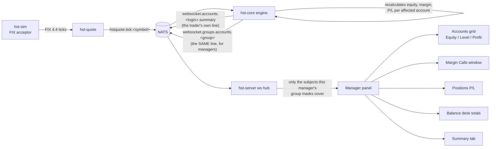
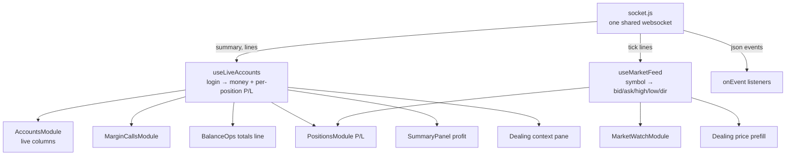
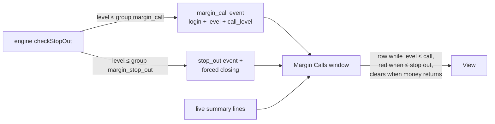
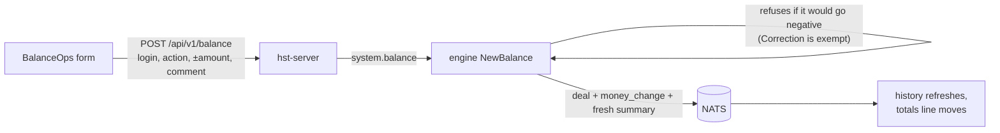
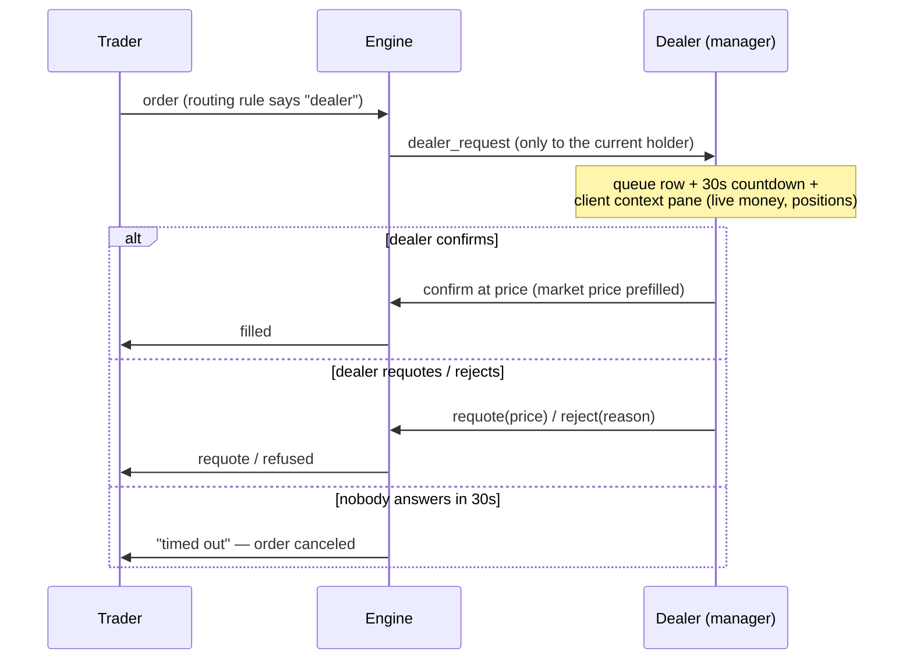

# Manager Panel — how the live system works

The manager panel is the running of the platform: live money, the dealing desk, margin
calls, the market. Everything live rides one idea: **the engine already computes every
number on every tick — the panel just subscribes to the right subjects.** Nothing is
polled that can be streamed; nothing is computed twice.

## The one picture



## Scope is the subject, not a filter

A manager socket is subscribed by the server (`hst-server ws.go subjectsFor`) to
`websocket.groups.accounts.<token>` **only for the group tokens their masks cover**
(`model.Subscriptions` + `ReduceMasks`, gated by the `acc_read` right). A manager with
`demo*` masks is physically never delivered a `real` account's frame — the isolation
happens in NATS, before any application code runs. There is no client-side filtering to
get wrong.

## The summary line — one format everywhere

The engine builds one comma line per account per tick (throttled to 500ms per account
per symbol, `hst-core/handler/publish.go SummaryFor`):

```
summary,<login>,<balance>,<credit>,<equity>,<margin>,<free>,<level>%,<profit>[,<positionId>,<positionProfit>]...
```

The trader terminal reads it for its own account; the manager panel reads the same line
for every account in scope. `Equity = Balance + Credit ± Floating P/L`,
`Free = Equity − Margin`, `Level = Equity / Margin × 100` — computed once, in the engine,
under the account's lock.

## Frontend: two hooks feed everything



- `socket.js` decodes every frame: `summary,` lines → `account_summary` events, other
  CSV → `market_feed`, JSON stays JSON. `sendEvent("start_market_feed")` opens the tick
  stream (managers receive every symbol, raw).
- Both hooks are module-level caches with listeners (the `useGroups` pattern) and batch
  their notifications (100–150ms), so a burst of ticks paints once.
- The tick map mutates in place — **never memoize on it** (that froze the market watch
  once already); read it fresh each render.

## Margin calls



The window itself needs no request: it joins the live account stream with the group
thresholds (`margin_call` / `margin_stop_out` from `useGroups`) and lists any account
whose margin is in use with a level at or under the call line.

## Balance operations



Operations: Balance, Credit, Charge, Correction, Bonus, Commission — blue button
deposits (+), red withdraws (−). Every operation lands as a **deal**, so the history is
just the account's balance-type deals.

## Dealing room



The desk is a Redis lease (90s TTL, 15s heartbeat). Only the dealers named on the
routing rule — and whose group masks cover the client — are ever offered the request.

## Where things live

| Piece | File |
|---|---|
| Group fan-out publishes | `hst-core/handler/ticks.go`, `publish.go`, `stopout.go`, `accounts.go` |
| Group-scoped subject | `hst-core/model/subjects.go SubjectGroupAccounts` |
| Frame decoding + send | `hst-admin-web/src/api/socket.js` |
| Live money cache | `hst-admin-web/src/hooks/useLiveAccounts.js` |
| Live prices cache | `hst-admin-web/src/hooks/useMarketFeed.js` |
| Accounts grid | `hst-admin-web/src/modules/accounts/AccountsModule.jsx` |
| Balance desk | `hst-admin-web/src/modules/balance/BalanceOps.jsx`, `BalanceModule.jsx` |
| Margin calls | `hst-admin-web/src/modules/margincalls/MarginCallsModule.jsx` |
| Market watch | `hst-admin-web/src/modules/market/MarketWatchModule.jsx` |
| Summary tab | `hst-admin-web/src/components/layout/SummaryPanel.jsx` |
| Dealing room | `hst-admin-web/src/modules/dealing/DealingModule.jsx` |

## Still open (the next plan)

Exposure tab (needs `coverage*` groups), throw-in quotes and spread overrides (needs a
quote-injection path in hst-quote), Online Users, Check/Fix Balance, account Trade tab
(trading on the client's behalf), bulk operations, notifications/e-mail, dealing
auto-processing.
