# Order lifecycle — one flow, end to end (hedging)

One concrete setup, one trader, one order walked from the Buy click to the closed
position — every validation, the routing rules, the fill, the money math, and every way
the position can end. All traced from the current code. The platform runs **hedging**
margin mode: every fill opens its own position; positions offset only through an
explicit close or close-by.

---

## 1. The setup the flow runs on

### Symbol (master): `EURUSD`

| Setting | Value | Used by |
|---|---|---|
| digits | 5 | price normalising, stops distance |
| contract size | 100 000 | margin & P/L math |
| currency base / profit / margin | EUR / USD / EUR | conversions to the account currency |
| volume min / max / step | 0.01 / 100 / 0.01 lots | gate 7 |
| stops level | 10 points | gate 12 — SL/TP and pending distance |
| freeze level | 5 points | gate 13 — edits near the market |
| quotes time | 60 s | gate 4 — quote freshness |
| exec mode | Instant | execution check (deviation / requote) |
| fill flags | FOK, IOC | gate 10 |
| trade mode | Full | gate 2 |
| sessions | Mon–Fri 00:00–24:00 | gate 3 |
| request timeout | 30 s | dealer queue expiry |

### Group: `real` — and its group-symbol override for `EURUSD`

| Setting | Value | Used by |
|---|---|---|
| currency | USD | account currency, all money in USD |
| margin mode | **Hedging** | every fill = its own position |
| margin call / stop out | 100 % / 50 % (percent mode) | §6 |
| limit: max orders / positions | 200 / 100 | gate 9 |
| group-symbol spread override | +2 points | the group's own bid/ask |
| swap long / short | −0.5 / +0.1 points daily | storage on open positions |
| commission | 0 | bookFill |

The group-symbol record can override anything from the symbol master per group
(spread, stops level, trade mode, swaps…) — the engine always reads through
`Settings.For(group, symbol)`, which is master + group override merged.

### Account: `1001`

| Field | Before the trade |
|---|---|
| group / currency | real / USD |
| leverage | 1 : 100 |
| balance | 10 000.00 |
| credit | 0.00 |
| equity = balance + credit + floating P/L | 10 000.00 |
| margin / free margin | 0.00 / 10 000.00 |
| open positions | none |

### Routing rules (walked top to bottom, first terminal match wins)

| # | Rule | Matches | Action |
|---|---|---|---|
| 1 | Reject during gap | gap condition | 1003 reject |
| 2 | Big tickets to the desk | volume > 1.00 lots | 1001 dealer |
| 3 | Automate the rest | everything | 1006 confirm at market |

---

## 2. The single flow: Buy 0.10 EURUSD, SL 1.08000, TP 1.09000

Market at the click: **bid 1.08343 / ask 1.08345** (group spread already applied).

```mermaid
flowchart TD
    subgraph CLIENT["1 — Terminal"]
        A["Buy 0.10 EURUSD, SL 1.08000, TP 1.09000"]
    end

    subgraph SERVER["2 — hst-server (shape only, no trading logic)"]
        B["payload valid? login>0, symbol, volume>0,<br/>enums valid, pending needs price, expiry when needed"]
        B2["lots → internal volume, publish system.orders<br/>answer 202 — result comes later on the websocket"]
    end

    subgraph ENGINE["3 — hst-core: the 14 gates, in this order"]
        C1["account exists & enabled, not investor/read-only"]
        C2["symbol tradable for the group (mode, side, not close-only)"]
        C3["market open: session + holiday — closing always passes"]
        C4["quote exists and younger than 60 s"]
        C5["order type + SL/TP allowed by symbol flags"]
        C6["expert trading allowed (if expert)"]
        C7["volume 0.10 ∈ [0.01, 100], step 0.01 ✓"]
        C8["order/position count under group limits,<br/>symbol volume cap incl. pendings"]
        C9["fill policy FOK ∈ symbol FillFlags ✓"]
        C10["expiry type allowed (GTC here) ✓"]
        C11["stops ≥ 10 points from close price:<br/>SL 1.08000 and TP 1.09000 vs bid 1.08343 ✓"]
        C12["freeze gate — new order: exempt"]
        C13["money: need = 0.10 × 100 000 × 1.08345 / 100<br/>= 108.35 margin ≤ free 10 000 ✓"]
        C14["execution check (Instant): volume ≤ MaxInstantVolume,<br/>quote fresh, slip inside deviation — else requote"]
    end

    subgraph ROUTE["4 — Routing walk"]
        R1["rule 1: gap? no → next"]
        R2["rule 2: 0.10 > 1.00? no → next"]
        R3["rule 3: matches all → 1006 confirm at market<br/>(no terminal rule at all ⇒ 10020 refused)"]
    end

    subgraph FILL["5 — Fill (hedging: always a NEW position)"]
        F1["price = ask 1.08345, normalised to 5 digits"]
        F2["position #96 opened: buy 0.10 @ 1.08345<br/>margin 108.35 reserved"]
        F3["deal written: entry=in, position_id=96,<br/>rate_profit USD→USD = 1"]
        F4["one transaction: order filled + position row<br/>+ deal row + account margins"]
        F5["events: order_create, position_create,<br/>deal_create, summary — terminal updates live"]
    end

    subgraph LIVE["6 — While it lives (every tick, this order)"]
        L0["reprice with group spread → floating P/L → summary line"]
        L1["1 expire pending orders"]
        L2["2 SL / TP: long closes on BID —<br/>bid ≤ 1.08000 → close [sl], bid ≥ 1.09000 → close [tp]"]
        L3["3 activate triggered pendings"]
        L4["4 stop-out check, always last:<br/>level = equity/margin — call at 100 %, stop out at 50 %<br/>then: drop margined pendings first,<br/>close biggest loser first, oldest per symbol,<br/>one at a time until recovered"]
        L5["daily swap: −0.5 pt/day accrues as storage"]
    end

    subgraph CLOSE["7 — How it ends (whichever comes first)"]
        X1["manual close (full, or partial volume) —<br/>FIFO: an older same-side position closes first (10025);<br/>no market-clock/money gate on the way out,<br/>only a live quote + routing admit"]
        X2["close-by: this buy vs an opposite sell on EURUSD,<br/>settled at the older leg's open price, two out_by deals"]
        X3["SL / TP hit (step 6.2)"]
        X4["stop out (step 6.4)"]
    end

    subgraph SETTLE["8 — Settlement (bid 1.08545 at the close)"]
        S1["out deal: position 96, profit =<br/>(1.08545 − 1.08345) × 0.10 × 100 000 = +20.00 USD"]
        S2["swap settled into storage, commission charged (0)"]
        S3["balance 10 000 → 10 020.00, margin released,<br/>equity = balance again"]
        S4["ledger law: balance ≡ Σ deals(profit+storage+fee) —<br/>Check/Fix Balance proves it any time"]
    end

    A --> B --> B2 --> C1 --> C2 --> C3 --> C4 --> C5 --> C6 --> C7 --> C8 --> C9 --> C10 --> C11 --> C12 --> C13 --> C14
    C14 --> R1 --> R2 --> R3 --> F1 --> F2 --> F3 --> F4 --> F5
    F5 --> L0 --> L1 --> L2 --> L3 --> L4 --> L5
    L5 --> X1 & X2 & X3 & X4
    X1 --> S1
    X2 --> S1
    X3 --> S1
    X4 --> S1
    S1 --> S2 --> S3 --> S4
```

Any gate that refuses stops the flow right there and the terminal receives the retcode
(`10008` invalid volume, `10006` stops too close, `10003` not enough money,
`10012` rejected by rule, `10013` requote, `10020` no rule admitted, …).
If rule 2 had matched (volume > 1 lot), the order would sit in the **dealer queue**
(`10023`) instead of step 5 — a dealer confirms (fills at their price), requotes,
rejects, or the 30 s sweep times it out (`10014`); a confirm re-enters the flow at
step 5 exactly.

---

## 3. The same flow for pending orders

A **buy limit 0.05 @ 1.08000** rides the identical flow with two differences:

1. After the routing confirm (step 4) it stops **on the book** as `placed` — no fill.
   The 14 gates already ran, including the pending-price distance
   (|1.08345 − 1.08000| ≥ 10 points ✓) and the money check.
2. Its fill happens later, inside step 6.3, the tick sweep: **Ask ≤ 1.08000** triggers
   it (buys trigger on Ask; sells on Bid; stops trigger on the same sides but crossing
   upward/downward; a **stop-limit** first converts into a limit at its trigger).
   Activation re-checks only expiry, routing (kind = activate) and money — then fills a
   limit **at its own price** and continues at step 5 as a new position.

| Type | Triggers when |
|---|---|
| buy limit | Ask ≤ order price |
| sell limit | Bid ≥ order price |
| buy stop | Ask ≥ order price |
| sell stop | Bid ≤ order price |
| buy stop-limit | Ask ≥ trigger → becomes buy limit |
| sell stop-limit | Bid ≤ trigger → becomes sell limit |

---

## 4. The numbers, end to end

| Moment | balance | margin | floating P/L | equity | free |
|---|---|---|---|---|---|
| before | 10 000.00 | 0 | 0 | 10 000.00 | 10 000.00 |
| open buy 0.10 @ 1.08345 | 10 000.00 | 108.35 | −0.20 (spread) | 9 999.80 | 9 891.45 |
| bid at 1.08545 | 10 000.00 | 108.35 | +20.00 | 10 020.00 | 9 911.65 |
| closed @ 1.08545 | **10 020.00** | 0 | 0 | 10 020.00 | 10 020.00 |

Margin = volume × contract × open price ÷ leverage, converted to the account currency
(EUR margin currency → USD via the live EURUSD rate; a missing cross triangulates
through USD). Floating P/L for a long = (bid − open) × volume × contract, converted the
same way. Stop-out example on this account: equity would have to fall to 54.18
(50 % of 108.35 margin) before forced closing begins — after a margin-call warning at
108.35 (100 %).
