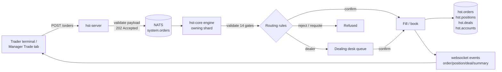
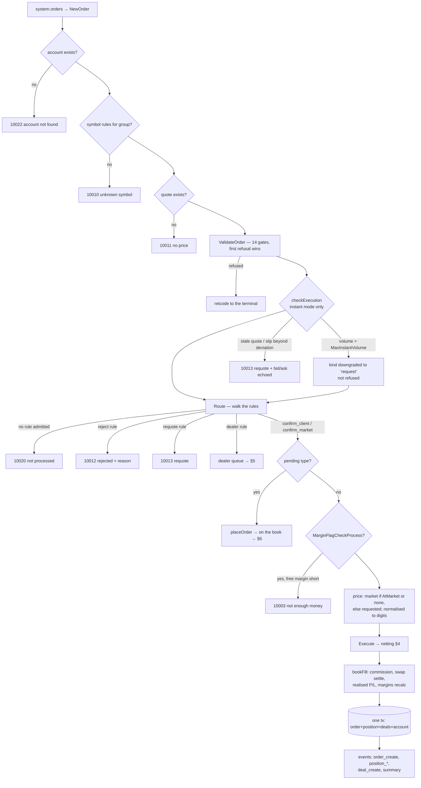
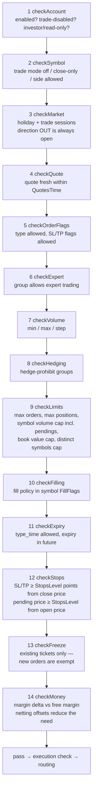
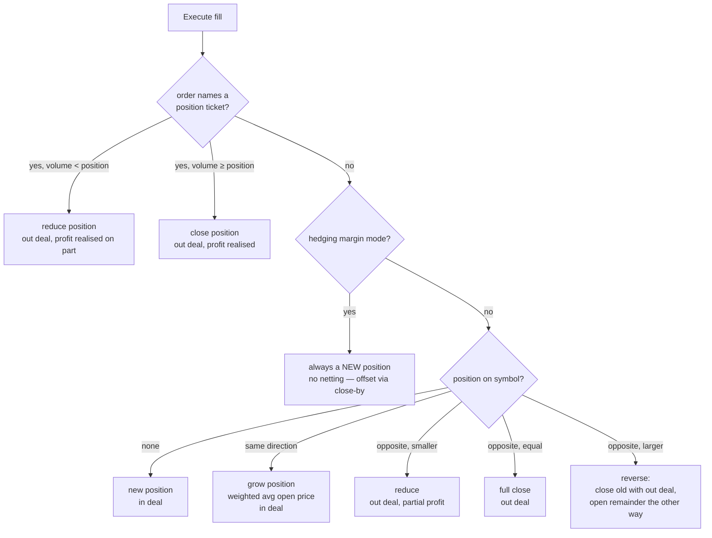
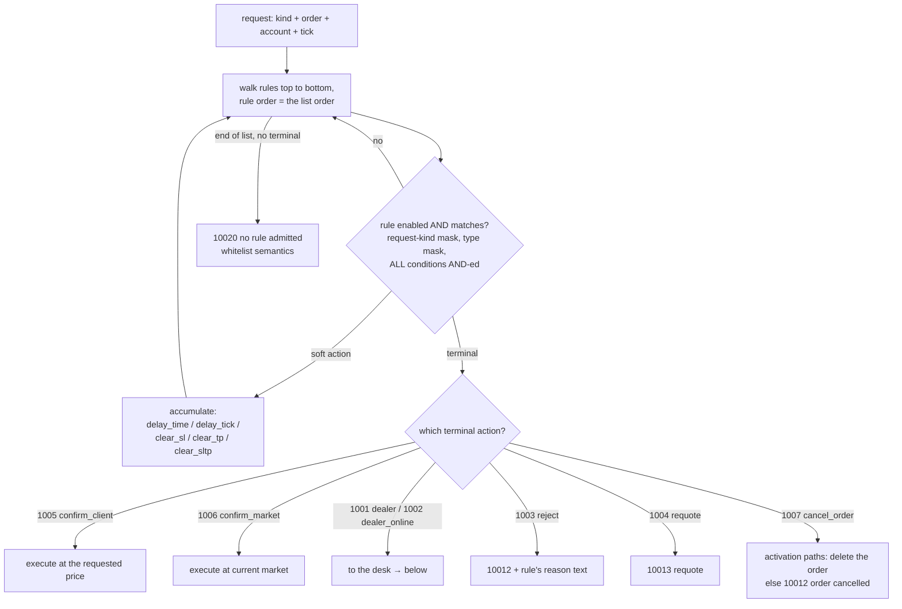
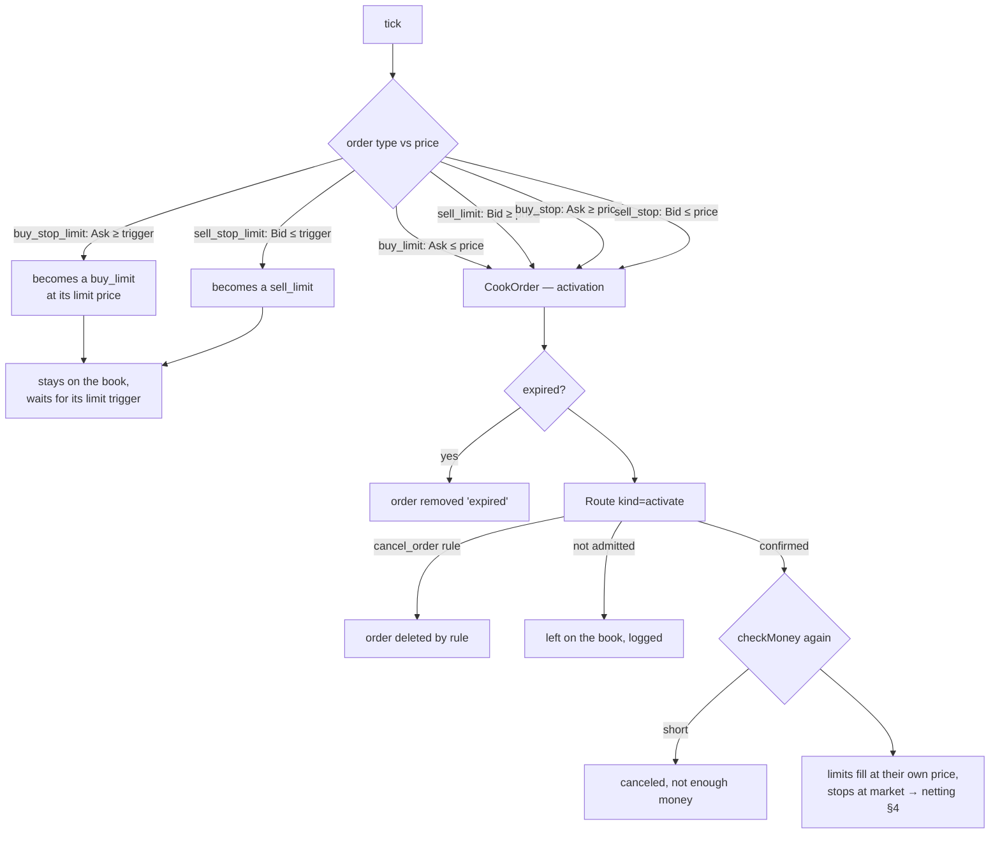
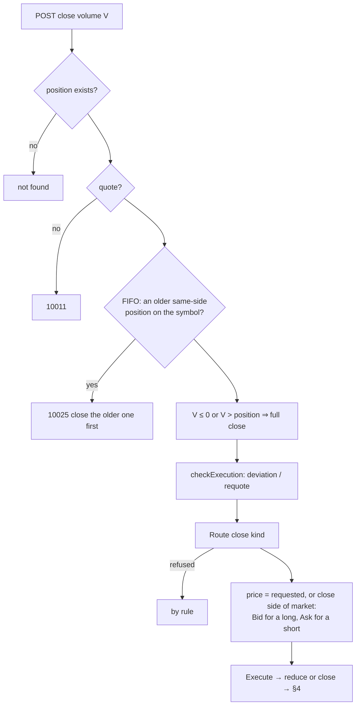
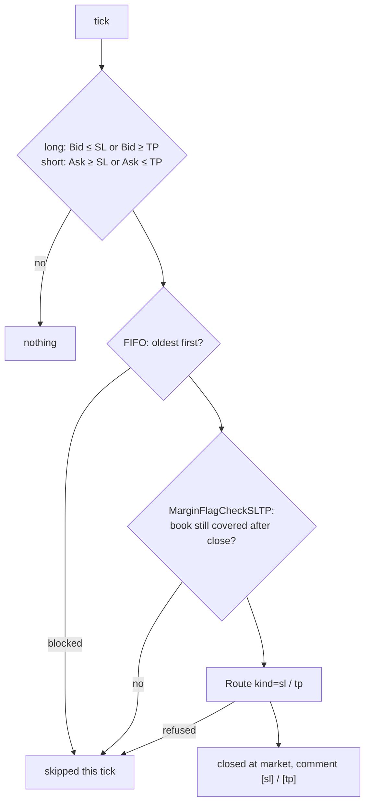
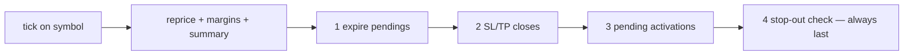
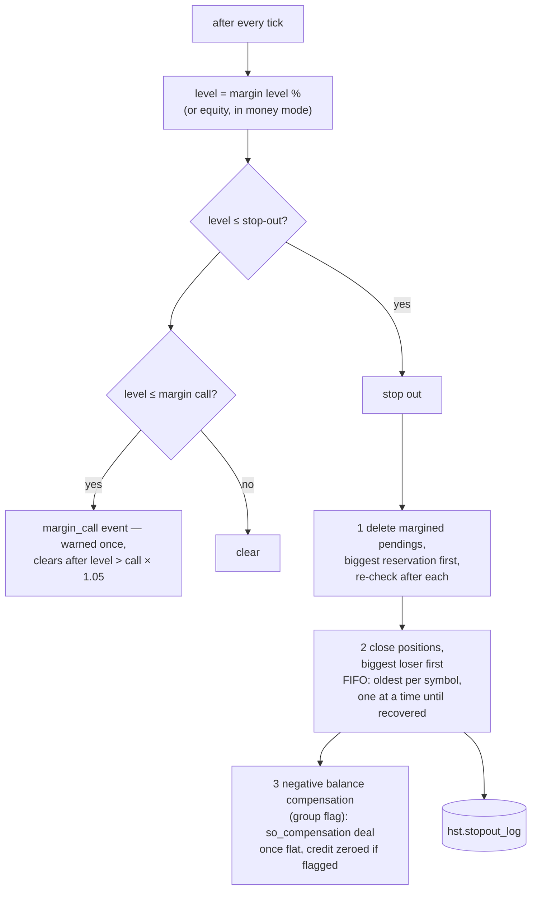

# Order lifecycle — buy to sell, open to close, end to end

Every flow below is traced from the current code (`hst-server/internal/server/v1/orders.go`,
`hst-core/handler/{orders,validate,routing,positions,pending,ticks,stopout,dealing}.go`).
Diagrams first, words only where a diagram cannot say it.

---

## 1. The big picture



The server answer is always **202 Accepted** — the real outcome (`order_create`,
`order_rejected`, `position_create`, …) arrives on the account's websocket.
The server checks only the payload shape; **all trading validation lives in the engine**.

---

## 2. Market order: open (buy or sell)



## 3. ValidateOrder — the 14 gates, in exact order



| Gate | Refusal |
|---|---|
| checkAccount | 1002 disabled / 10001 trading disabled |
| checkSymbol | 10010 / 10001 / 10016 close-only |
| checkMarket | 10002 market closed |
| checkQuote | 10011 no price |
| checkOrderFlags | 10001 / 10006 stops |
| checkExpert | 10001 |
| checkVolume | 10008 invalid volume |
| checkHedging | 10015 hedging not allowed |
| checkLimits | 10007 too many orders / 10021 volume limit |
| checkFilling | 10017 fill policy |
| checkExpiry | 10018 expiry |
| checkStops | 10006 stops too close |
| checkFreeze | 10019 frozen |
| checkMoney | 10003 not enough money |

---

## 4. Fill → netting (what a fill does to the book)



Deal entries: `in` opens/grows, `out` closes/reduces, `inout` marks a reversal's closing
deal, `out_by` marks both legs of a close-by. Every deal carries its `position_id`, which
is what Check Positions / Check Balance recompute from.

After every fill, `bookFill` runs in one transaction: commission → swap settle on closed
positions → realised P/L into balance (or BlockedProfit under day-P/L mode) → margins
recalculated → order/position/deal/account rows written → events published.

---

## 5. Routing rules — the walk



Rule conditions cover symbol/group masks (`!` negates, `*` globs), volume, spread, gap,
deviation, login, balance/equity/margin/level, position and order totals, time windows,
country and more — all conditions on a rule must hold at once.

### The dealer desk

```mermaid
sequenceDiagram
    participant E as Engine
    participant Q as Dealing queue
    participant D as Dealer(s)
    participant C as Client
    E->>Q: rule 1001/1002 → eligible dealers by group masks<br/>(none online + skip-flag → walk continues)
    E-->>C: 10023 queued
    Q->>D: offered to the current holder, in rule order
    alt confirm
        D->>E: price (dealer → client → market) → optional money re-check → fill
    else requote
        D->>C: new price; client accepts → fill
    else reject
        D->>C: 10012 + reason (max 31 chars)
    else return
        Q->>D: next dealer; all returned → 10024
    else timeout (30s, or symbol RequestTimeout)
        Q->>C: 10014 timed out (1s sweep)
    end
```

---

## 6. Pending orders: buy/sell limit, stop, stop-limit

### Placement

Placement runs the same 14 gates as a market order (checkStops also polices the pending
price distance, checkMoney reserves at placement), then routing; a confirming rule puts
the order on the book as `placed` — nothing fills yet.

### Trigger — on every tick

Trigger price is the **opening side**: Ask for buys, Bid for sells.



Expiry is swept first on every tick (`type_time` day/specified); a `reject` routing rule
on the expiration kind can deliberately hold an order past its time.

---

## 7. Close paths

### Manual close (full or partial)



A close runs **no** ValidateOrder: no market-open, stops, freeze or money gate — only the
quote must exist, and direction *out* bypasses sessions and holidays by design.

### Close-by (hedging accounts only)

Two opposite positions on the same symbol settle against each other at the older leg's
open price — two `out_by` deals, min volume of the two, no FIFO or market-open check.
Requires hedging margin mode (netting groups get 10015).

### SL / TP — on every tick

Tested on the **closing side**: Bid for a long, Ask for a short.



### The tick sweep order



---

## 8. Margin call and stop out



Every stop-out close is itself routed (`stop_out_order` / `stop_out_position` kinds), so a
rule can exempt a book from forced closing.

---

## 9. Retcodes — the full trading set

| Code | Meaning | | Code | Meaning |
|---|---|---|---|---|
| 0 | done | | 10012 | rejected by a routing rule |
| 1 | internal error | | 10013 | requote |
| 3 | invalid request | | 10014 | timed out (dealer queue) |
| 5 | not found | | 10015 | hedging is not allowed |
| 1002 | account disabled | | 10016 | closing only |
| 10001 | trading is disabled | | 10017 | fill policy not allowed |
| 10002 | market is closed | | 10018 | expiry not allowed |
| 10003 | not enough money | | 10019 | order is frozen |
| 10006 | stops are too close | | 10020 | no routing rule admitted this request |
| 10007 | too many orders | | 10021 | position volume limit reached |
| 10008 | invalid volume | | 10022 | account not found |
| 10010 | unknown symbol | | 10023 | placed in a dealer queue |
| 10011 | no price for this symbol | | 10024 | all dealers returned the request |
| | | | 10025 | an older position must be closed first (FIFO) |

---

## 10. Three subtleties worth knowing

1. **Instant mode oversize is not refused** — a market order above `MaxInstantVolume` is
   silently reclassified as a *request* kind and walks the routing rules under that kind.
2. **New orders skip the freeze gate** — `checkFreeze` only guards changes to existing
   tickets and positions.
3. **Closing is always allowed by the clock** — direction *out* bypasses sessions and
   holidays, so a trader can always get out; only a routing rule can refuse a close.
