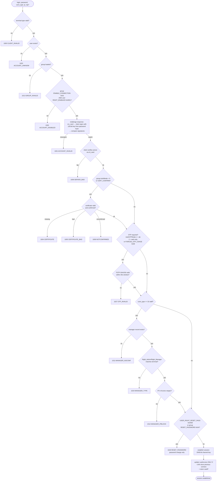

# Auth System — End-to-End Build Guide (MT5 parity)

Everything here is taken from MetaQuotes documentation. Each rule is tagged with its source:

- **[PROTO]** — *Authentication Protocols - Security - Platform Setup*
- **[WEBAPI]** — *Authentication - Web API - MetaTrader 5 API*
- **[CHKPWD]** / **[CHGPWD]** — *Check Password* / *Change Password - Users - Manager Interface (Rest API)*
- **[RETCODE]** — *Authentication - Return Codes - MetaTrader 5 API*
- **[SQL]** — the SQL Export schema (`mt5_users`, `mt5_managers`, `mt5_groups`)
- **[ENUM]** — enumeration pages (see `tables/07-enums.md`)
- **⚙️ OURS** — **not specified by MT5**; an implementation decision we must make

---

## Part 1 — What you are building

MT5 has **three authentication methods that stack on top of each other** [PROTO]:

| # | Method | Mandatory? | What it proves |
|---|---|---|---|
| 1 | **Standard** (password challenge-response) | **Always required, all account types** | the client knows the password *and* the server knows it too |
| 2 | **Advanced** (SSL certificate) | Optional, per group — **⛔ OUT OF SCOPE for v1, not being built** | the client holds a private key issued/approved by the broker |
| 3 | **OTP** (TOTP) | Optional, per group | the client holds the paired mobile device |

> "These three authentication methods can be all enabled to complement each other." [PROTO]

Login is an **unsigned integer, 1 … 18,446,744,073,709,551,615** — i.e. `uint64`. Not a username, not
an email. [PROTO]

---

## Part 2 — The identity model

From [SQL]:

```
clients.ClientID ──1:N──▶ users.Login ──1:1──▶ accounts.Login
                              ▲
                              └──0..1── managers.Login
```

`mt5_managers.Login` is documented as *"the user login, **based on which** the manager account is
created"* [SQL]. **A manager is a user with a manager record.** One login namespace, one credential
store. Do not build a second users table for staff.

Auth-relevant columns on `mt5_users` [SQL]:

| Column | Use in auth |
|---|---|
| `Login` | identity (uint64) |
| `Group` | which group policy applies |
| `Rights` | `EnUsersRights` bitmask — see Part 4 |
| `CertSerialNumber` | "the number of a last used certificate for user authorization" |
| `LastAccess` | *"not updated in real time… only updated when the user connects, if more than 24 hours have passed"* |
| `LastPassChange` | password rotation tracking |
| `LastIP` | last connection source address |
| `PhonePassword` | phone-support verification (**not** a login credential) |
| `Timestamp` | change marker — row changed when it advances |

**There is no password column in the SQL export.** Credentials are deliberately not exported.

---

## Part 3 — Password rules

### Format [PROTO] / [CHGPWD]
- Length **8–16 characters**. Minimum comes from the group's `AuthPasswordMin`; *"the lowest possible
  value is 8 characters. The maximum length is 16 characters."* [CHGPWD]
- **Complexity — the two MetaQuotes pages disagree, and you must pick one:**
  - [PROTO]: *"must contain at least two of three types of characters: lowercase letters, uppercase
    letters and digits."*
  - [CHGPWD]: *"must contain four character types: lowercase letters, uppercase letters, numbers, and
    special characters (#, @, ! etc.). For example, `1Ar#pqkj`."*
  - ⚙️ OURS: implement the **stricter [CHGPWD] rule** (four character classes) — it is the newer
    REST-era documentation, and relaxing a password policy later is easy while tightening it is not.

### Three password slots per login [ENUM] / [CHKPWD] / [CHGPWD]
`EnUsersPasswords`: `0 USER_PASS_MAIN`, `1 USER_PASS_INVESTOR`, `2 USER_PASS_API`. The REST API takes
these as strings [CHKPWD]:

| `type` | Meaning |
|---|---|
| `main` | the master password |
| `investor` | the investor password |
| `api` | *"the password used by the API clients for connection"* |

So your credential table is keyed **(login, type)**, not (login).

### Storage [PROTO]
> "The password is stored on the trading platform as **a hash of the password and additional data**."

That is a salted hash. ⚙️ OURS: MT5 does not name the algorithm for storage (it names MD5/SHA256/AES
for the *protocol*). Use argon2id for storage. **Do not use MD5 for storage** — MD5 appears in MT5 only
inside the challenge-response protocol, never as the at-rest format.

### Transport warning [CHKPWD]
> "We strongly urge you against passing passwords in the command parameters since request addresses may
> be logged/cached by intermediary network devices."

Accept `POST` with a JSON body. Support `GET` only if you must mirror MT5 exactly, and log-scrub it.

---

## Part 4 — Rights and group policy (the data that decides everything)

### `mt5_users.Rights` — `EnUsersRights` bitmask [ENUM]

| Bit | Flag | Meaning in auth |
|---|---|---|
| `0x0001` | `USER_RIGHT_ENABLED` | may connect at all |
| `0x0002` | `USER_RIGHT_PASSWORD` | may change own password |
| `0x0004` | `USER_RIGHT_TRADE_DISABLED` | ⚠️ **inverted** — set = trading OFF |
| `0x0008` | `USER_RIGHT_INVESTOR` | *"service value for internal use"* — do not set from app code |
| `0x0010` | `USER_RIGHT_CONFIRMED` | certificate is confirmed |
| `0x0200` | `USER_RIGHT_READONLY` | *"service value for internal use"* |
| `0x0400` | `USER_RIGHT_RESET_PASS` | must change password on next connection |
| `0x0800` | `USER_RIGHT_OTP_ENABLED` | may use OTP |
| `0x4000` | `USER_RIGHT_API_ENABLED` | may connect via Web API |
| `0x10000` | `USER_RIGHT_TECHNICAL` | technical account, hidden from managers without `Right_Acc_Technical` |

`0x1000` is undocumented on both source pages — **reserved, do not reuse**.

### Group policy — `mt5_groups` [SQL] / [ENUM]

| Column | Enum | Values |
|---|---|---|
| `AuthMode` | `EnAuthMode` | 0 standard, 1 RSA1024, 2 RSA2048 |
| `AuthPasswordMin` | — | minimum password length |
| `AuthOTPMode` | `EnAuthOTPMode` | 0 disabled, 1 TOTP-SHA256 **all connections**, 2 TOTP-SHA256 **web only** |
| `PermissionFlags` | `EnPermissionsFlags` | `0x01 CERT_CONFIRM`, `0x02 ENABLE_CONNECTION`, `0x04 RESET_PASSWORD`, `0x08 FORCED_OTP_USAGE`, `0x10 RISK_WARNING`, `0x20 REGULATION_PROTECT` |

### Connection type — `EnUsersConnectionTypes` [ENUM], banded

- **Clients 0–11**: 0 terminal, 3 web API, 4 iPhone, 5 Android, 11 WebTerminal
- **Staff 32+**: 32 admin, 33 manager, 34 manager API, 36 admin API, 37 manager web API

The band selects which rights matrix governs the session. `MT_RET_AUTH_CLIENT_INVALID (1000)` is
returned for an invalid terminal type [RETCODE].

---

## Part 5 — Standard authentication, stage by stage [PROTO]

> "The entire authentication mechanism is implemented on the server side."

### Stage 1 — server authenticates the client
1. Client sends an init command.
2. **Server generates a random sequence** and sends it to the terminal.
3. Client signs it using a **128-bit key derived from the client password hash**, sends the signature back.
4. Server performs the same computation and **compares signatures**.

### Stage 2 — client authenticates the server (mutual auth)
5. Client generates its **own random sequence** and sends it.
6. Server signs it; client verifies.

This proves the server also knows the password hash — it defeats a rogue/impostor server. **Do not skip
this stage**; it is why MT5 clients cannot be phished by a fake server address.

### Stage 3 — channel key
7. Server generates a **2048-bit channel encryption key**, derived from a random value + the client
   password derivative + session data.

Algorithms used across these stages: **MD5, SHA256, AES** [PROTO].

⚙️ OURS: if your v2 client is a browser over TLS, stages 1–3 can be replaced by TLS + a normal password
POST. **But if you want MT5 parity for native terminals, implement the challenge-response** — it is the
only way an MT5-compatible terminal can connect.

---

## Part 6 — Web API authentication (the REST variant) [WEBAPI]

This is the concrete, fully-specified flow — implement this first.

### Step 1 — start
```
GET /api/auth/start?version=484&agent=test&login=14&type=manager
```
| Param | Rule |
|---|---|
| `version` | web client version; *"enter any number but not less than 484"* |
| `agent` | arbitrary name, **must not be empty, must not contain spaces** |
| `login` | account login |
| `type` | *"Only one value is currently supported, which is 'manager'"* |

Response:
```json
{ "retcode": "0 Done", "version_access": "1290", "srv_rand": "d4e005317e38bc0c349a51a0d73a07eb" }
```
`srv_rand` = **random 16-byte sequence in hex**, generated by the server.

### Step 2 — answer
```
GET /api/auth/answer?srv_rand_answer=<hash>&cli_rand=<16-byte hex>
```
- `srv_rand_answer` = *"MD5 hash of the random sequence and the password hash"*
- `cli_rand` = a random 16-byte hex sequence **the client generates**, for authenticating the server back

### The password hash formula [WEBAPI]
```
password_hash = MD5( MD5('Password') + 'WebAPI' )
```
> "Six characters of the WebAPI are added to the MD5 hash of the password and once again an MD5 hash is
> obtained from the result."

Then `srv_rand_answer = MD5(srv_rand + password_hash)`.

### Timing rule
> "**No more than 10 seconds** should pass between the authentication start request and sending of a
> response to the server. Otherwise, authentication will fail."

So `srv_rand` is single-use state with a 10-second TTL. ⚙️ OURS: store it keyed by
`(login, connection)` in Redis with `EX 10`, and delete on use so a challenge cannot be replayed.

---

## Part 7 — Certificate authentication [PROTO] — ⛔ DEFERRED, not in v1

> **Scope decision: we are not building certificate authentication for now.** Documented here only so
> the group/user flags are understood and the columns are reserved in the schema. Skip Part 7 and
> step 9 of the build order; keep `CertSerialNumber`, `PermissionFlags 0x01 CERT_CONFIRM` and
> `USER_RIGHT_CONFIRMED 0x10` in the data model so enabling it later is not a migration.

- Uses **SSL certificates in PKCS#12 (`.pfx`) format**.
- Supports both **CA-issued certificates and certificates generated by the trade server**.
- Client-side storage: filesystem, Windows certificate store, or hardware token (eToken).
- `mt5_users.CertSerialNumber` records the last certificate used [SQL].
- Group flag `PermissionFlags 0x01 CERT_CONFIRM` requires confirmation; user flag
  `USER_RIGHT_CONFIRMED 0x10` records that it is confirmed [ENUM].

Relevant return codes [RETCODE]: `1003` extended authorization required, `1004` certificate required,
`1005` invalid certificate, `1006` certificate not confirmed, `1014` certificate generation disabled.

---

## Part 8 — OTP authentication [PROTO]

- Algorithm: **HMAC/TOTP SHA-256**, based on an OTP secret.
- **Valid for 30 seconds.** Server verifies using the secret + current time.
- Requires **time synchronisation** (NTP) on both mobile terminal and server.
- The OTP secret is transmitted **over the 2048-bit encrypted channel after basic authentication**,
  during initial binding of the mobile terminal to the account.
- Generated by the MT5 iOS/Android terminals.

Scope is decided by the **group** (`AuthOTPMode`: all connections vs web-only) and enabled per user
(`USER_RIGHT_OTP_ENABLED`). Failure → `MT_RET_AUTH_OTP_INVALID (1027)` [RETCODE].

---

## Part 9 — Manager-specific checks [SQL] / [RETCODE]

When the connection type is in the staff band (32+), these additional checks apply:

| Check | Column | Failure code |
|---|---|---|
| A manager record exists for this login | `mt5_managers.Login` | `1011 MT_RET_AUTH_MANAGER_NOCONF` — *"an appropriate manager configuration hasn't been created"* |
| Source IP is inside the allowed ranges | `Access` (e.g. `192.168.0.1-192.168.0.10,…`) | `1012 MT_RET_AUTH_MANAGER_IPBLOCK` |
| This terminal type is permitted | `Right_Admin` / `Right_Manager` | `1024 MT_RET_AUTH_MANAGER_TYPE` |
| Bound trade server matches | `Server` | `1015/1017` invalid ID / wrong server type |

Then **data scoping**, which is not a login check but must be enforced on every subsequent query:
- `Groups` — comma-separated group masks the manager may act on
- `RequestLimitLogs` / `RequestLimitReports` — 0 unlimited, 1=1mo, 2=3mo, 3=6mo, 4=1yr, 5=2yr, 6=3yr

And 99 `Right_*` columns (1 = granted, 0 = not) for feature-level permission — including **field-level
PII rights** (`Right_Acc_Details_Name/Location/Address/ID/EMail/Phone/General` and the same set under
`Right_Clients_Details_*`) and three separate dealing roles (`Right_Trades_Manager`,
`Right_Trades_Dealer`, `Right_Trades_Supervisor`).

---

## Part 10 — Return codes: your API contract [RETCODE]

Implement these exactly; they are what an MT5-compatible client expects.

| Code | Constant | When |
|---|---|---|
| 1000 | `AUTH_CLIENT_INVALID` | invalid terminal type |
| 1001 | `AUTH_ACCOUNT_INVALID` | invalid account |
| 1002 | `AUTH_ACCOUNT_DISABLED` | account disabled (`USER_RIGHT_ENABLED` clear) |
| 1003 | `AUTH_ADVANCED` | extended authorization required |
| 1004 | `AUTH_CERTIFICATE` | certificate required |
| 1005 | `AUTH_CERTIFICATE_BAD` | invalid certificate |
| 1006 | `AUTH_NOTCONFIRMED` | certificate not confirmed |
| 1007 | `AUTH_SERVER_INTERNAL` | connected to a non-access server |
| 1008 | `AUTH_SERVER_BAD` | server not authenticated |
| 1009 | `AUTH_UPDATE_ONLY` | only update available |
| 1010 | `AUTH_CLIENT_OLD` | old client version |
| 1011 | `AUTH_MANAGER_NOCONF` | no manager configuration |
| 1012 | `AUTH_MANAGER_IPBLOCK` | IP not valid for manager |
| 1013 | `AUTH_GROUP_INVALID` | group not initialised |
| 1014 | `AUTH_CA_DISABLED` | certificate generation disabled |
| 1015 | `AUTH_INVALID_ID` | invalid ID / server disabled |
| 1016 | `AUTH_INVALID_IP` | invalid address |
| 1017 | `AUTH_INVALID_TYPE` | wrong server type |
| 1018 | `AUTH_SERVER_BUSY` | server busy |
| 1019 | `AUTH_SERVER_CERT` | invalid server certificate |
| 1020 | `AUTH_ACCOUNT_UNKNOW` | unknown account |
| 1021 | `AUTH_SERVER_OLD` | outdated server |
| 1022 | `AUTH_SERVER_LIMIT` | license restriction |
| 1023 | `AUTH_MOBILE_DISABLED` | mobile connections not licensed |
| 1024 | `AUTH_MANAGER_TYPE` | connection type not permitted for manager |
| 1025 | `AUTH_DEMO_DISABLED` | demo creation disabled |
| 1026 | `AUTH_RESET_PASSWORD` | **master password must be changed** |
| 1027 | `AUTH_OTP_INVALID` | invalid one-time password |

Note MT5 distinguishes `1001 invalid account` from `1020 unknown account`. ⚙️ OURS: MT5 leaks account
existence here. For a public-facing web login, return one generic failure; keep the precise code only on
the MT5-compatible protocol endpoint where clients depend on it.

Password endpoints return their own codes, e.g. `3006 Invalid account password` [CHKPWD], `0 Done`
[CHGPWD].

---

## Part 11 — The login sequence, assembled



---

## Part 12 — Build order

1. **Data layer** — `clients`, `users`, `groups`, `managers` tables with the [SQL] columns; `Rights` as
   a `uint64` bitmask type; `EnUsersRights` / `EnAuthMode` / `EnAuthOTPMode` / `EnUsersConnectionTypes`
   / `EnPermissionsFlags` as Go constants generated from `tables/07-enums.md`.
2. **Credential store** — table keyed `(login, type)` with `main`/`investor`/`api`; argon2id;
   password policy validator (8–16, four character classes, group `AuthPasswordMin`).
3. **`/api/user/check_password` and `/api/user/change_password`** [CHKPWD][CHGPWD] — smallest useful
   slice, testable immediately, POST-with-body.
4. **Web API auth** [WEBAPI] — `/api/auth/start` + `/api/auth/answer`, `srv_rand` in Redis with a
   10-second TTL, `MD5(MD5(pwd)+"WebAPI")`, `cli_rand` server-side signing.
5. **Return-code ladder** [RETCODE] 1000–1027 as typed errors, so every failure path is exact from
   day one.
6. **Client-band login** — rights + group policy checks, `RESET_PASS` forced-change path,
   `LastAccess` 24-hour rule, `LastIP`.
7. **Manager band** — manager record, `Right_Admin`/`Right_Manager`, IP ranges, server binding; then
   group-mask scoping enforced **in the repository layer**.
8. **OTP** — TOTP-SHA256, 30-second window, secret binding after basic auth; group-scoped.
9. **Certificates** — PKCS#12, `CertSerialNumber`, `CONFIRMED` flag, codes 1003–1006.
10. **Native challenge-response** [PROTO] — only if MT5-compatible terminals must connect.

## Part 13 — Test checklist (each line maps to a rule above)

- login outside `1 … 2^64-1` rejected
- password 7 chars rejected; 17 chars rejected; missing a character class rejected
- group `AuthPasswordMin` overrides the floor of 8, never goes below it
- each of `main` / `investor` / `api` verified independently for the same login
- `api` slot rejected when `USER_RIGHT_API_ENABLED` is clear
- `USER_RIGHT_ENABLED` clear → 1002
- `USER_RIGHT_TRADE_DISABLED` set → login succeeds, trading refused (**inverted flag**)
- `USER_RIGHT_RESET_PASS` set → 1026, and *only* password change is permitted
- `srv_rand` reused → rejected; used after 10 s → rejected
- `agent` empty or containing a space → rejected [WEBAPI]
- staff conn type without a manager row → 1011
- manager from an out-of-range IP → 1012
- manager on a terminal type they lack the right for → 1024
- OTP accepted inside 30 s, rejected outside; web-only mode (`AuthOTPMode 2`) ignores OTP on native
- `LastAccess` not written on a reconnect within 24 h; written after
- manager queries never return accounts outside `managers.Groups`
